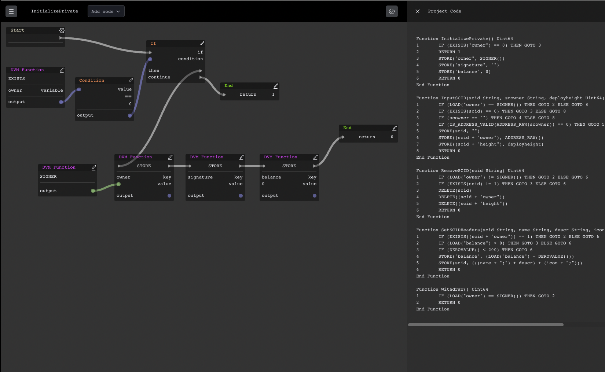

# Visual Scripting for DERO



This tool was made to design Smart contracts visually and generate DVM code to be deployed on the DERO Blockchain.

## Development

```sh
yarn && yarn dev
```

### TODO
- Graph & UI
  - [x] Add, remove, edit nodes and links
  - [x] Store in local storage
  - [x] Import / Export
  - [x] Code generation
  - [x] Split "Let-Dim" node, 
    - [x] DIMs are put at the top of the function, variables declared in the start node like the args
    - [x] make let nodes like a process with one input 
    - [x] make a variable node to use the name
  - [x] Make an Operation node for +, -, *, /, %, and also boolean &&, ||, ... (check docs)
  - [x] Refactor the control node to make it simpler. Conditions can be made with operation nodes
  - [x] Display Code in an expandable window on the right side
  -  [ ] Get rid of variable type ?
  - [ ] Export only a subset of functions
  - [ ] Rename function
  - [ ] Change function to process and vice versa
  - [ ] Remove function or process
  - [ ] [OPTIONAL] Graph schema Versionning and retrocompatibility
  - [ ] [OPTIONAL] Make links splines instead of straight lines
- Code generation
  - [ ] Parenthesis on expressions?
- Docs
  - [ ] Write some basic documentation
  - [ ] Make a tutorial video
- Deployment
  - [ ] Install / Test on DERO simulator
  - [ ] Deploy on IPFS
- [ ] Refactor
  - [ ] Header
  - [ ] Custom UI components
  - [ ] Graph types all in one place

### Improvements suggestions
> - Read from a smart contract
>
>Depending on how the smart contract is formatted it might be hard. I'm open to any advice on parsing.

> Right clicking a blank area of canvas brings up a list of nodes that can be created.
>* [x] Double clicking implemented instead, to keep the context menu and make life easier for trackpads.

> Perhaps a menu of object primitives along the top that can bed dragged into the scene
